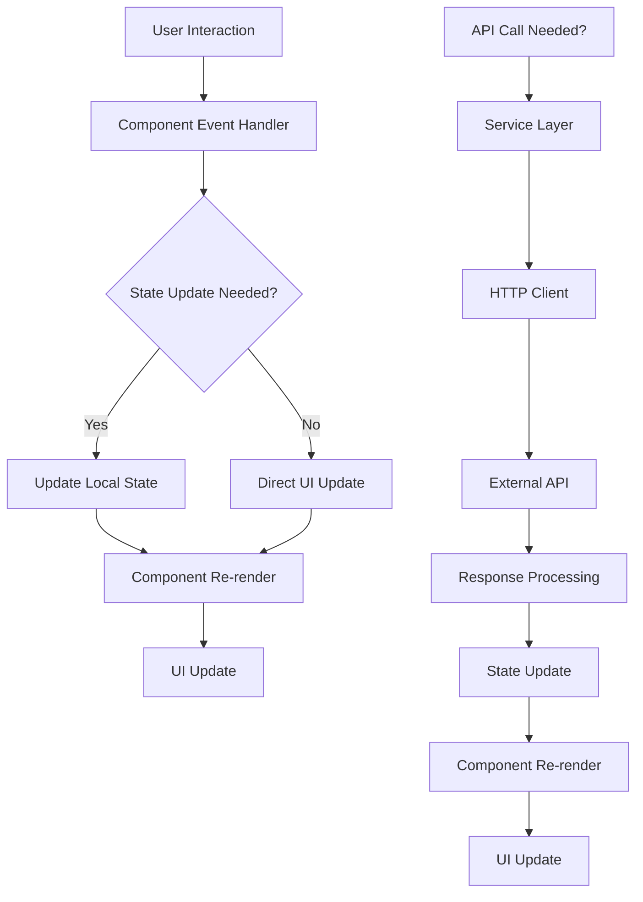
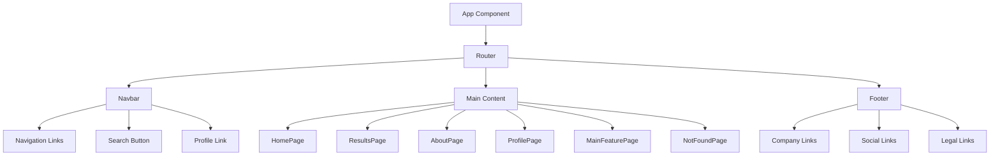

# Architecture Documentation

## Overview

This document outlines the technical architecture, design decisions, and project structure for the StyleLink application. It serves as a guide for developers to understand the codebase organization and architectural patterns.

## Table of Contents

1. [Project Structure](#project-structure)
2. [Component Hierarchy](#component-hierarchy)
3. [Data Flow](#data-flow)
4. [Design Decisions](#design-decisions)
5. [Technology Stack](#technology-stack)
6. [Development Patterns](#development-patterns)
7. [Future Considerations](#future-considerations)

## Project Structure

```
stylelink/
├── public/                 # Static assets and HTML template
│   ├── index.html         # Main HTML template
│   ├── manifest.json      # PWA manifest
│   └── favicon.ico        # Site favicon
├── src/                   # Source code
│   ├── components/        # Reusable UI components
│   │   ├── Navbar.tsx    # Navigation component
│   │   └── Footer.tsx    # Footer component
│   ├── pages/            # Page-level components
│   │   ├── HomePage.tsx  # Home page
│   │   ├── AboutPage.tsx # About page
│   │   ├── ResultsPage.tsx # Search results page
│   │   ├── ProfilePage.tsx # User profile page
│   │   ├── MainFeaturePage.tsx # Dynamic feature pages
│   │   └── NotFoundPage.tsx # 404 error page
│   ├── services/         # API and external services
│   │   └── apiService.ts # API communication layer
│   ├── data/            # Mock data and constants
│   │   └── demoData.ts  # Demo data for development
│   ├── types/           # TypeScript type definitions
│   │   └── index.ts     # Shared type definitions
│   ├── utils/           # Utility functions
│   ├── App.tsx          # Main application component
│   ├── index.tsx        # Application entry point
│   └── index.css        # Global styles and Tailwind imports
├── package.json         # Dependencies and scripts
├── tsconfig.json        # TypeScript configuration
├── tailwind.config.js   # Tailwind CSS configuration
├── postcss.config.js    # PostCSS configuration
└── README.md           # Project documentation
```

## Component Hierarchy

### Application Structure

```
App
├── Router (BrowserRouter)
│   ├── Navbar
│   │   ├── Logo
│   │   ├── Navigation Links
│   │   ├── Search Button
│   │   ├── Favorites Button
│   │   └── Profile Link
│   ├── Main Content (Routes)
│   │   ├── HomePage
│   │   ├── MainFeaturePage (Dynamic)
│   │   ├── ResultsPage
│   │   ├── AboutPage
│   │   ├── ProfilePage
│   │   └── NotFoundPage
│   └── Footer
│       ├── Company Links
│       ├── Social Links
│       └── Legal Links
└── Toaster (Notifications)
```

### Component Relationships

#### **Layout Components**
- **App**: Root component managing routing and global state
- **Navbar**: Persistent navigation across all pages
- **Footer**: Persistent footer with links and information

#### **Page Components**
- **HomePage**: Landing page with main features
- **MainFeaturePage**: Dynamic pages for specific features
- **ResultsPage**: Search and discovery results
- **AboutPage**: Company and product information
- **ProfilePage**: User profile and settings
- **NotFoundPage**: 404 error handling

#### **Shared Components**
- **Navigation Links**: Reusable navigation items
- **Buttons**: Standardized button components
- **Forms**: Reusable form components
- **Cards**: Content display components

## Data Flow

### Current Data Flow

```
User Interaction
    ↓
Component Event Handler
    ↓
State Update (useState/useContext)
    ↓
Component Re-render
    ↓
UI Update
```

### Planned Data Flow (Future)

```
User Interaction
    ↓
Component Event Handler
    ↓
Action Creator (Redux/Zustand)
    ↓
State Management Store
    ↓
Component Subscription
    ↓
Component Re-render
    ↓
UI Update
```

### API Integration Flow

```
Component
    ↓
API Service Layer
    ↓
HTTP Client (Axios)
    ↓
External API
    ↓
Response Processing
    ↓
State Update
    ↓
Component Re-render
```

## Design Decisions

### Frontend Architecture

#### **React with TypeScript**
- **Decision**: Use React 18 with TypeScript for type safety
- **Rationale**: TypeScript provides compile-time error checking and better developer experience
- **Trade-offs**: Slightly more verbose code, but significantly better maintainability

#### **Functional Components with Hooks**
- **Decision**: Use functional components with React hooks
- **Rationale**: Modern React pattern, better performance, easier testing
- **Trade-offs**: Learning curve for developers unfamiliar with hooks

#### **React Router for Navigation**
- **Decision**: Use React Router DOM for client-side routing
- **Rationale**: Standard routing solution for React applications
- **Trade-offs**: Additional bundle size, but provides robust routing features

### Styling Architecture

#### **Tailwind CSS**
- **Decision**: Use Tailwind CSS for utility-first styling
- **Rationale**: Rapid development, consistent design system, small bundle size
- **Trade-offs**: Learning curve, but provides excellent developer experience

#### **Component-Based Styling**
- **Decision**: Co-locate styles with components
- **Rationale**: Better maintainability and component isolation
- **Trade-offs**: Potential style duplication, but better organization

### State Management

#### **Current: Local State with Hooks**
- **Decision**: Use useState and useContext for state management
- **Rationale**: Simple for initial development, no additional dependencies
- **Trade-offs**: May become complex as application grows

#### **Future: Global State Management**
- **Planned**: Implement Redux Toolkit or Zustand for global state
- **Rationale**: Better state management for complex applications
- **Trade-offs**: Additional complexity, but better scalability

### API Architecture

#### **Service Layer Pattern**
- **Decision**: Create dedicated service layer for API calls
- **Rationale**: Separation of concerns, easier testing, reusable logic
- **Trade-offs**: Additional abstraction layer, but better organization

#### **Axios for HTTP Requests**
- **Decision**: Use Axios for HTTP client
- **Rationale**: Feature-rich, widely adopted, good TypeScript support
- **Trade-offs**: Larger bundle size than fetch, but better developer experience

## Technology Stack

### Core Technologies

| Technology | Version | Purpose | Justification |
|------------|---------|---------|---------------|
| React | 18.2.0 | UI Framework | Industry standard, excellent ecosystem |
| TypeScript | 4.9.5 | Type Safety | Better developer experience, fewer runtime errors |
| React Router DOM | 6.20.1 | Client-side Routing | Standard routing solution for React |
| Tailwind CSS | 3.3.6 | Styling | Utility-first, rapid development |
| Framer Motion | 10.16.5 | Animations | Smooth, performant animations |
| Axios | 1.6.2 | HTTP Client | Feature-rich, TypeScript support |

### Development Tools

| Tool | Purpose | Configuration |
|------|---------|---------------|
| Create React App | Build Tool | Standard CRA setup |
| ESLint | Code Linting | React app configuration |
| PostCSS | CSS Processing | Tailwind CSS integration |
| Node.js | Runtime | Version 16+ required |

### Build and Deployment

| Tool | Purpose | Configuration |
|------|---------|---------------|
| npm | Package Manager | Standard npm scripts |
| React Scripts | Build Tool | CRA build system |
| Webpack | Module Bundler | CRA default configuration |

## Development Patterns

### Component Patterns

#### **Functional Components**
```typescript
const ComponentName: React.FC<Props> = ({ prop1, prop2 }) => {
  // Component logic
  return (
    <div>
      {/* JSX content */}
    </div>
  );
};
```

#### **Custom Hooks**
```typescript
const useCustomHook = (dependency: string) => {
  const [state, setState] = useState(initialValue);
  
  useEffect(() => {
    // Side effects
  }, [dependency]);
  
  return { state, setState };
};
```

#### **Type Definitions**
```typescript
interface User {
  id: string;
  name: string;
  email: string;
}

interface ComponentProps {
  user: User;
  onUpdate: (user: User) => void;
}
```

### File Organization Patterns

#### **Component Files**
- One component per file
- Co-locate related files (styles, tests, types)
- Use descriptive file names
- Export default for main component

#### **Service Files**
- Group related API calls
- Use descriptive function names
- Include error handling
- Provide TypeScript types

#### **Utility Files**
- Pure functions only
- Include JSDoc comments
- Export named functions
- Include unit tests

### Code Quality Patterns

#### **Naming Conventions**
- Components: PascalCase (e.g., `UserProfile`)
- Files: PascalCase for components, camelCase for utilities
- Variables: camelCase (e.g., `userName`)
- Constants: UPPER_SNAKE_CASE (e.g., `API_BASE_URL`)

#### **Import Organization**
```typescript
// React imports
import React, { useState, useEffect } from 'react';

// Third-party imports
import { BrowserRouter } from 'react-router-dom';
import axios from 'axios';

// Local imports
import { User } from '../types';
import { apiService } from '../services';
```

## Future Considerations

### Scalability Planning

#### **State Management Evolution**
- **Phase 1**: Local state with hooks (current)
- **Phase 2**: Context API for global state
- **Phase 3**: Redux Toolkit or Zustand for complex state

#### **Component Architecture**
- **Current**: Monolithic components
- **Future**: Atomic design system
- **Considerations**: Design system, component library

#### **Performance Optimization**
- **Code Splitting**: Implement route-based code splitting
- **Lazy Loading**: Lazy load non-critical components
- **Memoization**: Use React.memo and useMemo strategically
- **Bundle Optimization**: Analyze and optimize bundle size

### Technology Evolution

#### **Framework Updates**
- **React**: Stay current with React versions
- **TypeScript**: Upgrade to latest TypeScript features
- **Dependencies**: Regular dependency updates

#### **New Features**
- **PWA Support**: Progressive Web App capabilities
- **Offline Support**: Service worker implementation
- **Real-time Features**: WebSocket integration
- **Mobile App**: React Native or Flutter consideration

### Architecture Evolution

#### **Microservices Integration**
- **API Gateway**: Centralized API management
- **Service Discovery**: Dynamic service registration
- **Load Balancing**: Distributed request handling

#### **Data Management**
- **Caching Strategy**: Redis or similar caching layer
- **Database Optimization**: Query optimization and indexing
- **Real-time Data**: WebSocket or Server-Sent Events

## Data Flow Diagram



## Component Interaction Diagram



---

*This architecture documentation should be updated as the application evolves and new architectural decisions are made.*
